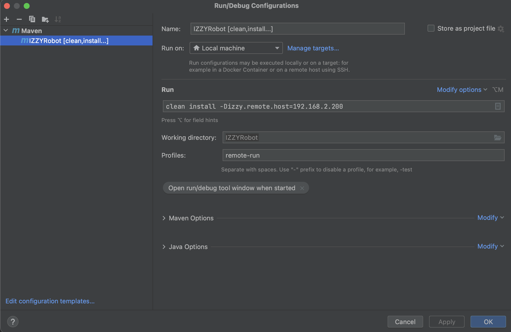

# IZZY Project

Disclaimer: This is the code that runs on the robot itself. 
To view the control interface code, visit [this project](https://github.com/rmdPurdue/JavaMother)

## Prerequisite Software
This project requires Java 11, Git, and Maven.

To install Java 11, visit [this link](https://docs.aws.amazon.com/corretto/latest/corretto-11-ug/downloads-list.html)

To install Git, visit [this link](https://git-scm.com/book/en/v2/Getting-Started-Installing-Git)

To install Maven, visit [this link](https://maven.apache.org/install.html)

## Installation
The IZZY project uses Maven to handle dependencies to install the code,
first clone this repository to your local machine.

    git clone https://github.com/rmdPurdue/javaIZZY-2018.git

## Run the Code
Before running the robot code, you should start the Mother (control) code first.
At the time of this writing, Mother needs to be started first in order for log messages
to be transferred between the robot and the control interface (feel free to fix this later)

After starting Mother on the choices network, enter the following command on your computer 
(no need to remote into IZZY to do anything for this project):

    mvn clean install -Dizzy.remote.host=192.168.2.200

You can replace the IP address with IZZY's IP, but as of this writing, the RaspberryPi is set to 
grab the static IP of 192.168.2.200 on the 192.168.2.0/24 network of the choices router. (you're computer
also has to be on this network)

### Troubleshooting:

If choices doesn't have internet, run the following command on a network with internet before running the above command:

    mvn clean compile

## IDE Integrations
I enjoy using IntelliJ for this project because it has very easy-to-use Git and Maven features built in.
You are however, not going to be negatively impacted if you have another IDE. Here is my build configuration in IntelliJ

